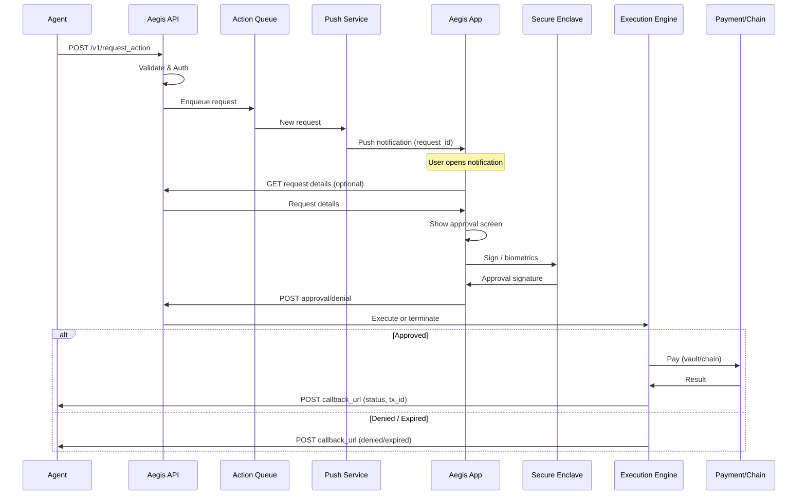
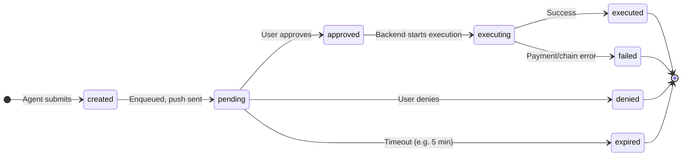

# Aegis: App Flow Specification

---

## 0. 流程速查（Quick Reference）

### 5 阶段流程

| 阶段 | 执行者 | 动作 | 结果状态 |
|------|--------|------|----------|
| **1. 进入** | Agent | `POST /v1/request_action` | `created` → `pending` |
| **2. 触达用户** | Backend | 发推送（含 `request_id`） | 用户设备收到推送 |
| **3. 用户决策** | User + App | 打开 App → 审批详情 → 批准/拒绝（生物识别） | `approved` / `denied` |
| **4. 执行/终止** | Backend | 批准：执行支付；拒绝：终止 | `executing` → `executed`/`failed` 或 `denied`/`expired` |
| **5. 回调** | Backend | POST 至 `callback_url` | Agent 收到最终状态 |

### 状态转换速查

| 从状态 | 到状态 | 触发条件 |
|--------|--------|----------|
| `created` | `pending` | 推送发出 |
| `pending` | `approved` | 用户批准 |
| `pending` | `denied` | 用户拒绝 |
| `pending` | `expired` | 超时（如 5 分钟） |
| `approved` | `executing` | 后端开始执行 |
| `executing` | `executed` | 支付成功 |
| `executing` | `failed` | 支付失败 |

**完整流程：** 见下方 §0（详细路径）和 §1（E2E 序列图）

---

## 0.1. 请求从进入到回调：完整路径（权威描述）

以下为单条请求的**唯一主路径**，所有 API 设计、UX 界面与状态均须与此一致。

| 阶段 | 步骤 | 谁执行 | 结果/下一阶段 |
|------|------|--------|----------------|
| **进入** | 1 | Agent 调用 `POST /v1/request_action` | 后端返回 `request_id`，请求入队，状态 `created` → `pending` |
| **触达用户** | 2 | 后端发推送（含 `request_id`） | 用户设备收到推送，可深链至审批页 |
| **用户决策** | 3 | 用户打开 App（深链/首页列表）→ 查看审批详情 → 批准或拒绝（批准前生物识别） | App 向后端提交决策 |
| **执行/终止** | 4a | 若批准：后端执行支付（金库/链） | 状态 `executing` → `executed` 或 `failed` |
| | 4b | 若拒绝或超时：后端终止 | 状态 `denied` 或 `expired` |
| **回调** | 5 | 后端向 Agent 的 `callback_url` 发送 POST | Agent 收到 `request_id`、`status`、可选 `tx_hash`/`payment_id`/`error_*` |

**一致性原则：** API Spec 中的端点、状态枚举、回调 payload 须与上述阶段一一对应；Mobile UX Spec 中的审批详情、推送与深链、结果反馈须覆盖步骤 2～3 的界面与交互。

---

## 1. 端到端流程（E2E）

从 Agent 发起请求到回调的完整序列如下。涉及系统：**Agent**、**Aegis API**、**Aegis Backend**（Queue、Push、Execution）、**User Device**（Notification、App、Secure Enclave）、**Payment/Chain**。

**步骤摘要：**

| Step | 系统 | 动作 |
|------|------|------|
| 1 | Agent → API | 认证后调用 `POST /v1/request_action` |
| 2 | API | 校验请求、入队、触发推送 |
| 3 | Push → App | 向用户设备发推送（含 request_id，用于深链） |
| 4 | User | 点击推送，打开 App（冷/热启动），解析 deep link |
| 5 | App | 拉取请求详情（若未在推送中带齐），展示审批页 |
| 6 | App + Enclave | 用户批准/拒绝，批准前生物识别，本地签名 |
| 7 | App → API | 提交审批结果（含签名） |
| 8 | Backend | 若批准：执行支付（金库/链）；若拒绝：终止 |
| 9 | Backend → Agent | 向 `callback_url` 发送最终状态（含 request_id、status、tx_hash/payment_id 等） |

### 1.1. 与 API / UX 对齐表

实现时须保证流程步骤与 API、UX 的下列对应关系一致，避免三者脱节。

| E2E 步骤 | API 行为（见 [API Spec](Aegis-API-Spec.md)） | UX 界面/交互（见 [Mobile UX Spec](Aegis-Mobile-UX-Spec.md)） |
|----------|-----------------------------------------------|---------------------------------------------------------------|
| 1 进入 | `POST /v1/request_action`，201 返回 `request_id`、`status: "pending"` | —（Agent 侧） |
| 2 触达 | 后端内部：入队、发推送；可选 `GET /v1/requests/{id}` 供 App 拉详情 | 推送文案（标题/正文含金额、收款方）；Deep Link 带 `request_id` |
| 3 决策 | App 提交决策：需定义端点（如 `POST /v1/me/requests/{id}/approve` 或 `deny`）；响应 200/409（重复） | 审批详情页：金额、收款方、描述、批准/拒绝；批准前 Face ID/Touch ID |
| 4 执行/终止 | 后端内部；状态见状态机 | 结果反馈：toast 或结果页（成功/失败/已拒绝） |
| 5 回调 | 后端 POST 至 `callback_url`，body 含 `request_id`、`status`、`timestamp`、可选 `tx_hash`/`payment_id`/`error_*` | —（Agent 侧）；App 历史/审计可展示终态 |

**状态枚举必须一致：** 本文档状态机中的状态名（如 `pending`、`executed`、`denied`、`expired`、`failed`）须与 API Spec 的 `status` 枚举及回调 payload 中的 `status` 字段完全一致。

---

## 2. 审批状态机

请求从创建到终态的状态与转换如下。

### 2.0. 状态转换表（补充 Mermaid）

| 从状态 | 到状态 | 触发者 | 条件/说明 |
|--------|--------|--------|-----------|
| `[*]` | `created` | Agent | Agent 提交请求 |
| `created` | `pending` | Backend | 推送发出后 |
| `pending` | `approved` | User | 用户批准 |
| `pending` | `denied` | User | 用户拒绝 |
| `pending` | `expired` | Backend | 超时（如 5 分钟） |
| `approved` | `executing` | Backend | Execution Engine 开始执行 |
| `executing` | `executed` | Payment Gateway / Chain | 支付成功 |
| `executing` | `failed` | Payment Gateway / Chain | 支付失败 |
| `executed` | `[*]` | — | 终态 |
| `failed` | `[*]` | — | 终态 |
| `denied` | `[*]` | — | 终态 |
| `expired` | `[*]` | — | 终态 |

---

**状态定义：**

| 状态 | 说明 |
|------|------|
| `created` | 请求已接收并写入队列，尚未向用户推送 |
| `pending` | 已推送，等待用户批准/拒绝或超时 |
| `approved` | 用户已批准，等待后端执行 |
| `denied` | 用户拒绝 |
| `expired` | 超时未操作（如 5 分钟），视为拒绝 |
| `executing` | 后端正在执行支付/链上交易 |
| `executed` | 执行成功 |
| `failed` | 执行失败（支付网关或链上错误） |

**转换责任：**

- **created → pending:** 后端在推送发出后更新。
- **pending → approved / denied / expired:** 由用户操作或定时任务（超时）触发。
- **approved → executing:** 后端 Execution Engine 拉取任务时更新。
- **executing → executed / failed:** 由支付网关或链上结果回调/轮询更新。

**超时策略建议：** 从 `pending` 创建时间起，超过 N 分钟（如 5）无用户操作则自动置为 `expired`，并回调 Agent 为 `expired`。

**与 API 的对应：** 上述状态即 API 中 `GET /v1/requests/{request_id}` 返回的 `status` 及回调 body 中的 `status` 取值；新增或修改状态时须同步更新 [Aegis-API-Spec.md](Aegis-API-Spec.md) 的枚举与 CallbackPayload。

---

## 3. 关键子流程

### 3.1. 用户首次使用（Onboarding）

1. **注册/登录**：用户注册或登录 Aegis 账户。
2. **绑定设备与推送**：App 向后端注册设备 ID 与推送 token（FCM/APNs）。
3. **添加支付方式**：至少添加一种——加密货币钱包或信用卡。
   - **加密货币**：输入/导入私钥，仅存于设备 Secure Enclave；后端仅存储公钥/地址与链信息。
   - **信用卡**：在 App 内填写卡信息，经 SDK 提交至 PCI 金库，后端仅存储金库返回的 token，不存 CVV。
4. **可选：连接 Agent**：用户将 Aegis 账户与某 Agent 平台绑定（如 OAuth 或 agent_id 关联），以便该 Agent 可代表该用户发起请求。

### 3.2. 收到审批请求（Request-to-Decision）

1. **推送到达**：后端通过 FCM/APNs 向用户设备发推送。
2. **用户点击**：系统打开 Aegis App（冷启动或从后台唤醒），并传入 deep link（如 `aegis://approve?request_id=xxx`）。
3. **解析与拉取**：App 解析 `request_id`，若需要则向 API 拉取完整请求详情。
4. **展示审批页**：展示金额、币种、收款方、描述、可选支付方式；主操作「批准」「拒绝」。
5. **用户决策**：用户点击批准或拒绝；若批准，先触发 Face ID/Touch ID。
6. **上传决策**：App 将决策与（批准时的）本地签名上传至后端。
7. **结果反馈**：App 展示成功/失败/已拒绝的 toast 或结果页，并返回列表或首页。

### 3.3. 加密货币支付执行

1. **后端构造未签名交易**：Execution Engine 根据请求金额、收款地址、链与资产构造原始交易。
2. **下发给 App**：后端将未签名交易（或交易摘要）下发给 App（或 App 主动拉取）。
3. **本地签名**：App 使用 Secure Enclave 中私钥签名，签名不离开设备。
4. **上传签名**：App 仅上传已签名交易（或签名结果）至后端。
5. **广播**：后端将已签名交易广播至对应链，并轮询或监听交易结果。
6. **状态更新与回调**：将状态更新为 `executed` 或 `failed`，并调用 Agent 的 `callback_url`。

### 3.4. 信用卡支付执行

1. **用户批准后**：后端从「用户批准 DB」获知该请求已批准及所选支付方式。
2. **调支付网关**：Execution Engine 使用金库中该卡的 token 向 Stripe/Adyen 等发起扣款（金额、币种、描述与请求一致）。
3. **无 App 二次交互**：常规扣款不要求用户再次打开 App；若支付网关要求 3DS，可再定义「3DS 重定向至 App 或 Web」子流程。
4. **结果与回调**：根据网关返回更新为 `executed` 或 `failed`，并调用 Agent 的 `callback_url`。

---

## 4. 异常与边界

### 4.1. 网络中断

- **Agent → API**：Agent 应实现重试与幂等（`idempotency_key`）；API 可返回 5xx 时 Agent 重试。
- **App → API**：App 提交审批结果时若网络失败，应在本地保留「待同步」状态，恢复网络后重试上传；后端对同一 `request_id` 的重复提交做幂等（只接受第一次最终决策）。
- **离线时待审批**：App 可缓存已拉取的 pending 请求，离线时仍可展示列表；审批操作需在网络恢复后同步。

### 4.2. 重复推送 / 重复点击

- **同一 request_id**：后端只接受一次「批准」或「拒绝」的最终决策；后续重复提交返回 409 或等价状态，且不改变已记录结果。
- **推送去重**：同一请求在未达终态前可重发推送，但应避免短时间对同一 request_id 重复推送造成骚扰。

### 4.3. 用户拒绝或超时

- **denied**：用户点击拒绝后，状态置为 `denied`，回调 Agent 的 `callback_url`，status 为 `denied`。
- **expired**：超时后自动置为 `expired`，同样回调，status 为 `expired`，Agent 可据此提示用户或重试（需重新发起新请求）。

### 4.4. 执行失败

- **failed**：支付网关或链上返回失败时，状态置为 `failed`，回调中带上 `error_code`/`message`（若适用），便于 Agent 向用户说明或重试。

---

## 5. 与其它规格的对应关系

- **权威路径**：「请求从进入到回调」的完整路径以本文档 **§0** 与 **§1** 为准；API 与 UX 设计不得与上述步骤或状态机冲突。
- **API 行为**：端点、请求/响应、回调 payload、**status 枚举**须与本文档状态机及 §1.1 对齐表一致，见 [Aegis-API-Spec.md](Aegis-API-Spec.md)。
- **移动端行为**：审批页、推送与深链、生物识别、结果反馈须覆盖 §0 中「触达用户」「用户决策」及「执行/终止」的展示，见 [Aegis-Mobile-UX-Spec.md](Aegis-Mobile-UX-Spec.md)。
- **验收**：流程与状态机的实现完成度可对照 [Aegis-Implementation-Todos.md](Aegis-Implementation-Todos.md) 中 F-04、F-05 的 Checklist 验收。
