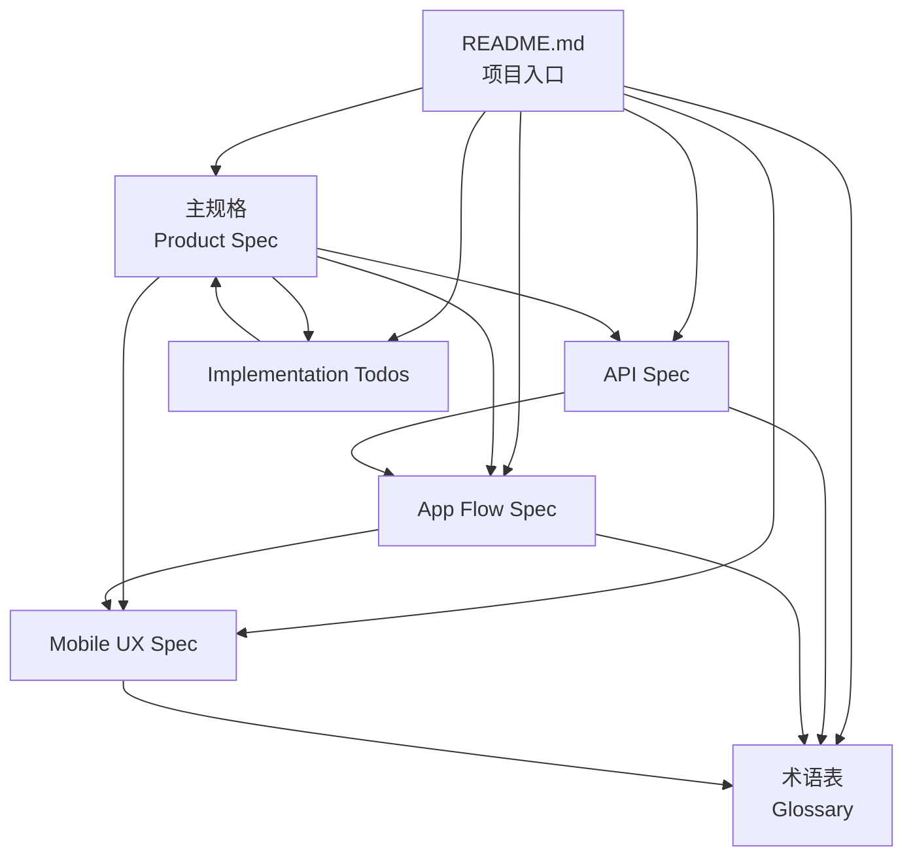

# Aegis MVP Prototype

## 0. TL;DR

**Aegis** 是一个 AI Agent 消费授权协议，让 AI 代理可以安全地代表用户发起支付请求，而无需暴露用户的信用卡或私钥。本仓库包含一个可运行的 MVP 原型：

- **Agent-facing API**：`POST /v1/request_action` 提交支付请求
- **Web 审批页面**：通过邮件 magic link 进行审批（开发环境捕获在 outbox）
- **动作状态机**：完整的请求生命周期管理（created → pending → approved/denied → executed/failed）
- **模拟支付通道**：card 和 crypto 两个 mock 执行通道
- **Webhook 队列**：HMAC 签名、重试调度
- **TypeScript SDK**：示例 Agent 脚本
- **OpenAPI YAML**：API 规范

**快速开始：** `npm install && npm run dev`，然后访问 `http://localhost:3000`

---

## 1. 文档索引

| 文档 | 类型 | 用途 | 链接 |
|------|------|------|------|
| **主规格** | Product Spec | 产品愿景、核心功能（F-01～F-06）、目标用户 | [Aegis Product Specification](Aegis_%20AI%20Agent%20Consumption%20Authorization%20Protocol%20-%20Product%20Specification.md) |
| **API 规格** | API Spec | REST API 端点、鉴权、回调、数据模型 | [Aegis-API-Spec.md](Aegis-API-Spec.md) |
| **App 流程** | Flow Spec | 端到端流程、审批状态机、子流程、异常处理 | [Aegis-App-Flow-Spec.md](Aegis-App-Flow-Spec.md) |
| **移动端 UX** | UX Spec | 界面设计、信息架构、推送与深链、无障碍 | [Aegis-Mobile-UX-Spec.md](Aegis-Mobile-UX-Spec.md) |
| **实施清单** | Todos | Phase 0～3 的 Todo 与 F-01～F-06 的验收 Checklist | [Aegis-Implementation-Todos.md](Aegis-Implementation-Todos.md) |
| **术语表** | Glossary | 统一术语定义，按字母和主题分类 | [Aegis-Glossary.md](Aegis-Glossary.md) |

---

## 2. 文档关系图



---

## 3. 核心概念

### 3.1. 关键术语

- **Agent（代理）**：AI 代理，通过 API 发起支付请求
- **Request（请求）**：一条待审批的支付请求，有唯一 `request_id`
- **Approval Workflow（审批流程）**：用户批准/拒绝的流程，包含推送、App 展示、生物识别
- **Execution Engine（执行引擎）**：后端执行支付的组件，调用支付网关或广播链上交易
- **Secure Enclave / StrongBox**：设备安全芯片，存储私钥和 CVV

**完整术语定义见：** [Aegis-Glossary.md](Aegis-Glossary.md)

### 3.2. 核心功能（Feature ID）

| ID | 功能 | 说明 |
|----|------|------|
| F-01 | Secure Credential Vault | 私钥/CVV 仅存储在设备安全芯片 |
| F-02 | Multi-Asset Support | 支持 ETH/SOL 钱包和信用卡 |
| F-03 | Agent-Facing Universal API | REST API 端点 `/v1/request_action` |
| F-04 | HITL Approval Workflow | 推送 → App → 审批 → 生物识别 |
| F-05 | Proxy Execution Engine | 后端代理执行支付 |
| F-06 | Immutable Audit Trail | 不可篡改的审计记录 |

**详细说明见：** [主规格 §3](Aegis_%20AI%20Agent%20Consumption%20Authorization%20Protocol%20-%20Product%20Specification.md#3-core-features--functionality)

---

## 4. 快速开始

### 4.1. 安装与启动

```bash
npm install
npm run dev
```

访问：
- `http://localhost:3000/` - 首页
- `http://localhost:3000/admin` - 管理面板
- `http://localhost:3000/dev/emails` - 开发环境邮件 outbox

### 4.2. 测试数据

- **API Key**: `aegis_demo_agent_key`
- **User ID**: `usr_demo`

### 4.3. 创建支付请求（Card 通道）

```bash
curl -s http://localhost:3000/v1/request_action \
  -H 'Content-Type: application/json' \
  -H 'X-Aegis-API-Key: aegis_demo_agent_key' \
  -d '{
    "idempotency_key": "demo-card-1",
    "end_user_id": "usr_demo",
    "action_type": "payment",
    "callback_url": "http://localhost:3000/_test/callback",
    "details": {
      "amount": "19.99",
      "currency": "USD",
      "recipient_name": "Demo Merchant",
      "description": "Test card payment",
      "payment_rail": "card",
      "payment_method_preference": "card_default",
      "recipient_reference": "merchant_api:demo_merchant"
    }
  }'
```

然后：
1. 从响应中获取 `approval_url`（或从 `/dev/emails` 查看邮件）
2. 打开 `approval_url` 进行审批
3. 查看回调结果：`http://localhost:3000/_test/callbacks`

### 4.4. 运行示例 Agent

```bash
npx tsx examples/agent-demo.ts
```

### 4.5. 运行测试

```bash
npm test
```

---

## 5. API 快速参考

| 端点 | 方法 | 用途 | 文档 |
|------|------|------|------|
| `/v1/request_action` | POST | 提交支付请求 | [API Spec §2.1](Aegis-API-Spec.md#21-post-v1request_action) |
| `/v1/requests/{id}` | GET | 查询请求状态 | [API Spec §2.2](Aegis-API-Spec.md#22-get-v1requestsrequest_id) |
| `/cancel` | POST | 取消请求（如适用） | API Spec |
| `/{callback_url}` | POST | Webhook 回调（Agent 提供） | [API Spec §3](Aegis-API-Spec.md#3-webhook-回调) |

**完整 API 文档：** [Aegis-API-Spec.md](Aegis-API-Spec.md)

---

## 6. 项目结构

```
.
├── README.md                          # 本文档
├── Aegis_ AI Agent...md              # 主规格
├── Aegis-API-Spec.md                 # API 规格
├── Aegis-App-Flow-Spec.md            # 流程规格
├── Aegis-Mobile-UX-Spec.md           # UX 规格
├── Aegis-Implementation-Todos.md     # 实施清单
├── Aegis-Glossary.md                 # 术语表
├── src/                               # 源代码
│   ├── services/                     # 服务层
│   ├── db.ts                          # 数据库
│   └── ...
├── examples/                          # 示例代码
│   └── agent-demo.ts                  # Agent 示例
└── openapi.yaml                       # OpenAPI 规范
```

---

## 7. MVP 说明 / 原型限制

本 MVP 原型用于架构和流程验证，**非生产就绪**：

- **Web 审批**：使用 magic link + 模拟 passkey/OTP 源标志（真实 WebAuthn/OTP 流程未实现）
- **支付执行**：card 和 crypto 通道为 **mock 提供者**，根据 `recipient_reference` / description 确定性成功/失败
- **邮件投递**：捕获在 `email_outbox`，在 `/dev/emails` 渲染
- **合规性**：本原型设计用于架构和流程验证，**非生产合规**

---

## 8. 相关资源

- **术语表**：[Aegis-Glossary.md](Aegis-Glossary.md) - 统一术语定义
- **实施指南**：[Aegis-Implementation-Todos.md](Aegis-Implementation-Todos.md) - Phase 0～3 任务清单
- **流程详解**：[Aegis-App-Flow-Spec.md](Aegis-App-Flow-Spec.md) - 端到端流程与状态机

---

## 9. 原始内容（保留）

This repo now includes a runnable MVP prototype for the Aegis plan:
- Agent-facing API (`/v1/request_action`, `/v1/actions/:id`, `/cancel`, capabilities, webhook test)
- Web approval page via email magic link (captured in dev outbox)
- Action state machine + audit trail
- Mock execution rails (`card` and `crypto`) with unified result model
- Webhook queue, HMAC signing, retry scheduling
- TS SDK + example agent
- OpenAPI YAML

## Quick Start

```bash
npm install
npm run dev
```

Open:
- `http://localhost:3000/` (home)
- `http://localhost:3000/admin` (admin dashboard)
- `http://localhost:3000/dev/emails` (dev email outbox)

## Seed Data

- API key: `aegis_demo_agent_key`
- `end_user_id`: `usr_demo`

## Create a Payment Request (Card Rail)

```bash
curl -s http://localhost:3000/v1/request_action \
  -H 'Content-Type: application/json' \
  -H 'X-Aegis-API-Key: aegis_demo_agent_key' \
  -d '{
    "idempotency_key": "demo-card-1",
    "end_user_id": "usr_demo",
    "action_type": "payment",
    "callback_url": "http://localhost:3000/_test/callback",
    "details": {
      "amount": "19.99",
      "currency": "USD",
      "recipient_name": "Demo Merchant",
      "description": "Test card payment",
      "payment_rail": "card",
      "payment_method_preference": "card_default",
      "recipient_reference": "merchant_api:demo_merchant"
    }
  }'
```

Then open the `approval_url` from the response (or from `/dev/emails`), approve/deny, and check callback inbox:
- `http://localhost:3000/_test/callbacks`

## Example Agent Script

```bash
npx tsx examples/agent-demo.ts
```

## Testing

```bash
npm test
```

## MVP Notes / Intentional Prototype Gaps

- Web approval uses **magic link + simulated passkey/OTP source flag** (real WebAuthn/OTP flows are not implemented yet).
- Card and crypto execution are **mock providers** with deterministic success/failure based on `recipient_reference` / description.
- Email delivery is captured in `email_outbox` and rendered in `/dev/emails`.
- This prototype is designed for architecture and flow validation, not production compliance.

## Dev/Sandbox Debug Endpoints (Prototype)

- `POST /api/dev/workers/tick` : run one worker cycle (expire approvals, execute approved actions, dispatch webhooks)
- `POST /api/dev/actions/:actionId/decision` : force `approve` / `deny` / `expire` for debugging
- `GET /api/dev/webhooks` : inspect webhook deliveries (`?action_id=...&status=pending`)
- `POST /api/dev/webhooks/:deliveryId/requeue` : requeue a failed/dead delivery for replay
- `GET /api/dev/actions/:actionId/audit` : inspect audit trail for one action
