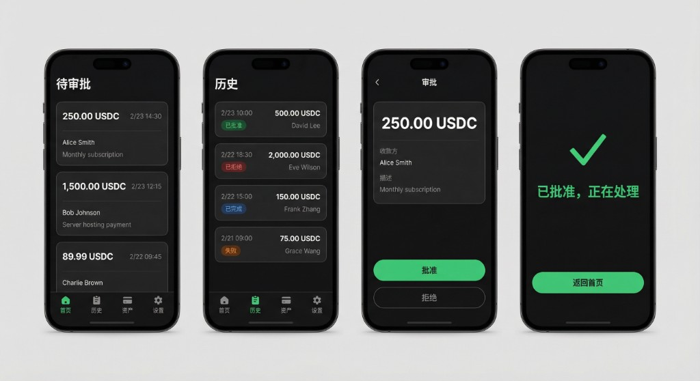
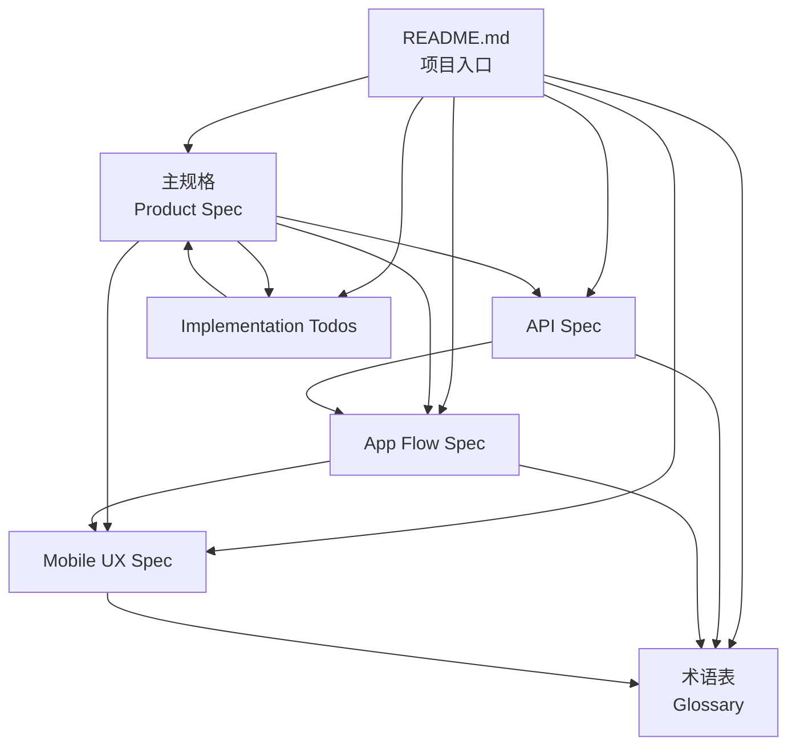

# Aegis MVP Prototype

[](https://github.com/josecookai/Aegis/actions/workflows/ci.yml)
[](https://github.com/josecookai/Aegis/actions/workflows/cd.yml)

**GitHub:** [https://github.com/josecookai/Aegis](https://github.com/josecookai/Aegis)

**Aegis** 是 AI Agent 消费授权协议，让 AI 代理安全地代表用户发起支付请求，而无需暴露信用卡或私钥。

---

## 0. 一键安装（AI Agent 友好）

```bash
# 后端
npm install && npm run dev

# 移动端（可选）
cd app && npm install && npx expo start --ios
```

**验证：** `http://localhost:3000/healthz` 返回 `ok`。测试数据：`API_KEY=aegis_demo_agent_key`，`USER_ID=usr_demo`。

---

## 1. 开发进度

| Phase | 进度 | 说明 |
|-------|------|------|
| Phase 0 规格 | 100% | 移动端 UX、API、App Flow 规格完成 |
| Phase 1 后端 | 100% | request_action、邮件触达、Web 审批、mock/Stripe 执行、Webhook、审计、设备注册、幂等头 |
| Phase 2 移动端 | 50% | 审批闭环可演示（首页/历史/审批详情/Face ID）；推送待做 |
| Phase 3 集成 | 33% | SDK、OpenAPI、MCP Server；真实支付网关/链上待做 |

**已完成：** Agent API、App API（pending/history/approval）、Web 审批、Passkey、MCP HTTP Server、Stripe 集成（可选）、部署配置（Vercel/Railway/Docker）。

---

## 2. 测试覆盖

```bash
npm test
```

| 测试文件 | 用例数 | 覆盖 |
|----------|--------|------|
| `tests/app.test.ts` | 21 | 审批流程、幂等、设备 CRUD、Webhook 签名、sandbox 故障注入 |
| `tests/mcp.test.ts` | 5 | MCP 工具调用、Aegis 客户端 |
| `tests/mobile-api.test.ts` | 3 | App 侧 API 错误处理、生物识别决策 |

**当前：** 29 个测试全绿。E2E 验收见 [docs/E2E-Verification-Checklist.md](docs/E2E-Verification-Checklist.md)。

---

## 3. 可以做什么

| 能力 | 说明 |
|------|------|
| **Agent 发起支付** | `POST /v1/request_action`，支持 card/crypto 通道、幂等 |
| **Web 审批** | Magic link 打开审批页，Passkey/OTP 模拟或真实 WebAuthn |
| **App 审批** | 首页待审批列表 → 点击 → Face ID 批准 → 历史记录 |
| **MCP 工具** | `aegis_request_payment`、`aegis_get_payment_status`、`aegis_cancel_payment`、`aegis_list_capabilities` |
| **Stripe 真实扣款** | 配置 `STRIPE_SECRET_KEY` 后，card 通道走 Stripe PaymentIntent |
| **Webhook 回调** | HMAC 签名、重试队列、replay UI |
| **Dev 工具** | Sandbox 故障注入、Webhook 重放、Passkey 注册、邮件 outbox |

---

## 4. 部署

| 方式 | 说明 |
|------|------|
| **Vercel** | 后端 serverless；SQLite 用 `/tmp`（冷启动重置）；Cron 触发 worker |
| **Railway** | 后端 + MCP 长驻；SQLite 持久化 |
| **Docker** | `docker build -t aegis . && docker run -p 3000:3000 -e BASE_URL=... aegis` |

**步骤：** 见 [docs/DEPLOYMENT.md](docs/DEPLOYMENT.md)。验证：`./scripts/verify-deployment.sh <后端URL> <MCP_URL>`。

---

## 5. 项目概览

| 组件 | 技术栈 | 说明 |
|------|--------|------|
| 后端 | Node.js + Express + SQLite | Agent API、App API、Web 审批、Webhook |
| 移动端 | Expo (React Native) | 待审批列表、审批详情、历史记录、Face ID |
| MCP Server | Node.js + MCP SDK | HTTP 模式，供 OpenClaw/Manus 调用 |
| SDK | TypeScript | 示例 Agent 脚本 |

---

## 6. 移动端 UI Demo

移动端 App 提供 4 个主导航：**首页（待审批）**、**历史**、**资产**、**设置**。审批流程如下：



| 屏幕 | 中文 | 英文 | 功能 |
|------|------|------|------|
| 待审批 | 首页 | Pending | 卡片列表：金额、收款方、时间、描述；点击进入审批详情 |
| 历史 | 历史 | History | 状态 badge（已批准/已拒绝/已完成/失败）；分页加载 |
| 审批 | 审批 | Approval | 金额、收款方、描述；批准（绿）/拒绝（灰）按钮；批准前 Face ID |
| 结果 | 已批准，正在处理 | Approved, processing | ✓ 图标 + 返回首页按钮 |

**状态 Badge 颜色：** 已批准(绿)、已拒绝(红)、已完成(蓝)、失败(橙)。暗色主题 `#0a0a0a`。

---

## 7. 文档索引

| 文档 | 类型 | 用途 | 链接 |
|------|------|------|------|
| **主规格** | Product Spec | 产品愿景、核心功能（F-01～F-06）、目标用户 | [Aegis Product Specification](Aegis_%20AI%20Agent%20Consumption%20Authorization%20Protocol%20-%20Product%20Specification.md) |
| **API 规格** | API Spec | REST API 端点、鉴权、回调、数据模型 | [Aegis-API-Spec.md](Aegis-API-Spec.md) |
| **App 流程** | Flow Spec | 端到端流程、审批状态机、子流程、异常处理 | [Aegis-App-Flow-Spec.md](Aegis-App-Flow-Spec.md) |
| **移动端 UX** | UX Spec | 界面设计、信息架构、推送与深链、无障碍 | [Aegis-Mobile-UX-Spec.md](Aegis-Mobile-UX-Spec.md) |
| **实施清单** | Todos | Phase 0～3 的 Todo 与 F-01～F-06 的验收 Checklist | [Aegis-Implementation-Todos.md](Aegis-Implementation-Todos.md) |
| **E2E 演示脚本** | Demo | 9 步手动测试 + Checklist | [Aegis-E2E-Demo-Script.md](Aegis-E2E-Demo-Script.md) |
| **OpenClaw 配置** | Setup | MCP URL、环境变量、验证 tools | [docs/OpenClaw-Setup.md](docs/OpenClaw-Setup.md) |
| **Manus 接入** | Setup | REST 直连 + MCP | [docs/Manus-Setup.md](docs/Manus-Setup.md) |
| **E2E 验收 Checklist** | Verification | 验收结果、Peer Review、Bug 列表 | [docs/E2E-Verification-Checklist.md](docs/E2E-Verification-Checklist.md) |
| **术语表** | Glossary | 统一术语定义，按字母和主题分类 | [Aegis-Glossary.md](Aegis-Glossary.md) |

---

## 8. 文档关系图



---

## 9. 核心概念

### 9.1. 关键术语

- **Agent（代理）**：AI 代理，通过 API 发起支付请求
- **Request（请求）**：一条待审批的支付请求，有唯一 `request_id`
- **Approval Workflow（审批流程）**：用户批准/拒绝的流程，包含推送、App 展示、生物识别
- **Execution Engine（执行引擎）**：后端执行支付的组件，调用支付网关或广播链上交易
- **Secure Enclave / StrongBox**：设备安全芯片，存储私钥和 CVV

**完整术语定义见：** [Aegis-Glossary.md](Aegis-Glossary.md)

### 9.2. 核心功能（Feature ID）

| ID | 功能 | 说明 |
|----|------|------|
| F-01 | Secure Credential Vault | 私钥/CVV 仅存储在设备安全芯片 |
| F-02 | Multi-Asset Support | 支持 ETH/SOL 钱包和信用卡 |
| F-03 | Agent-Facing Universal API | REST API 端点 `/v1/request_action` |
| F-04 | HITL Approval Workflow | 推送 → App → 审批 → 生物识别 |
| F-05 | Proxy Execution Engine | 后端代理执行支付 |
| F-06 | Immutable Audit Trail | 不可篡改的审计记录 |

**详细说明见：** [主规格 §3](Aegis_%20AI%20Agent%20Consumption%20Authorization%20Protocol%20-%20Product%20Specification.md#3-core-features--functionality)

---

## 10. 快速开始

### 10.1. 安装与启动

```bash
npm install
npm run dev
```

访问：
- `http://localhost:3000/` - 首页
- `http://localhost:3000/admin` - 管理面板
- `http://localhost:3000/dev/emails` - 开发环境邮件 outbox

### 10.2. 测试数据

- **API Key**: `aegis_demo_agent_key`
- **User ID**: `usr_demo`

### 10.3. 创建支付请求（Card 通道）

```bash
curl -s http://localhost:3000/v1/request_action \
  -H 'Content-Type: application/json' \
  -H 'X-Aegis-API-Key: aegis_demo_agent_key' \
  -d '{
    "idempotency_key": "demo-card-1",
    "end_user_id": "usr_demo",
    "action_type": "payment",
    "callback_url": "http://localhost:3000/_test/callback",
    "details": {
      "amount": "19.99",
      "currency": "USD",
      "recipient_name": "Demo Merchant",
      "description": "Test card payment",
      "payment_rail": "card",
      "payment_method_preference": "card_default",
      "recipient_reference": "merchant_api:demo_merchant"
    }
  }'
```

然后：
1. 从响应中获取 `approval_url`（或从 `/dev/emails` 查看邮件）
2. 打开 `approval_url` 进行审批
3. 查看回调结果：`http://localhost:3000/_test/callbacks`

### 10.4. 运行示例 Agent

```bash
npx tsx examples/agent-demo.ts
```

### 10.5. 启动移动端 App（可选）

```bash
cd app
npm install
npx expo start --ios
```

App 支持：首页待审批列表、审批详情（token 或 action_id 入口）、Face ID/Touch ID、历史记录分页。完整 E2E 演示见 [Aegis-E2E-Demo-Script.md](Aegis-E2E-Demo-Script.md)。

### 10.6. 运行测试

```bash
npm test
```

---

## 11. API 快速参考

**Agent 侧：**

| 端点 | 方法 | 用途 | 文档 |
|------|------|------|------|
| `/v1/request_action` | POST | 提交支付请求 | [API Spec §2.1](Aegis-API-Spec.md#21-post-v1request_action) |
| `/v1/actions/:id` | GET | 查询请求状态 | API Spec |
| `/v1/actions/:id/cancel` | POST | 取消请求 | API Spec |
| `/{callback_url}` | POST | Webhook 回调（Agent 提供） | [API Spec §3](Aegis-API-Spec.md#3-webhook-回调) |

**App 侧（移动端）：**

| 端点 | 方法 | 用途 |
|------|------|------|
| `/api/app/approval` | GET | 拉取审批详情（token 或 action_id+user_id） |
| `/api/app/approval/decision` | POST | 提交批准/拒绝 |
| `/api/app/pending` | GET | 待审批列表 |
| `/api/app/history` | GET | 历史记录（分页） |

**完整 API 文档：** [Aegis-API-Spec.md](Aegis-API-Spec.md)

---

## 12. 项目结构

```
.
├── README.md                          # 本文档
├── Aegis_ AI Agent...md              # 主规格
├── Aegis-API-Spec.md                 # API 规格
├── Aegis-App-Flow-Spec.md            # 流程规格
├── Aegis-Mobile-UX-Spec.md           # UX 规格
├── Aegis-Implementation-Todos.md   # 实施清单
├── Aegis-E2E-Demo-Script.md          # E2E 演示脚本
├── Aegis-Glossary.md                 # 术语表
├── src/                               # 后端源代码
│   ├── services/                     # 服务层
│   ├── routes/                       # API 路由（Agent + App）
│   └── ...
├── app/                               # 移动端 App（Expo）
│   ├── app/                          # 页面与路由
│   └── lib/                          # API 客户端
├── examples/                          # 示例代码
│   └── agent-demo.ts                  # Agent 示例
└── openapi.yaml                       # OpenAPI 规范
```

---

## 13. MVP 说明 / 原型限制

本 MVP 原型用于架构和流程验证，**非生产就绪**：

- **Web 审批**：使用 magic link + 模拟 passkey/OTP 源标志（真实 WebAuthn/OTP 流程未实现）
- **移动端审批**：支持 token 和 action_id 双入口、Face ID/Touch ID；推送（FCM/APNs）待实现
- **支付执行**：card 和 crypto 通道为 **mock 提供者**，根据 `recipient_reference` / description 确定性成功/失败
- **邮件投递**：捕获在 `email_outbox`，在 `/dev/emails` 渲染
- **用户鉴权**：App 侧 pending/history 端点当前无 session 鉴权（MVP 用 user_id 参数）
- **合规性**：本原型设计用于架构和流程验证，**非生产合规**

---

## 14. 相关资源

- **术语表**：[Aegis-Glossary.md](Aegis-Glossary.md) - 统一术语定义
- **实施指南**：[Aegis-Implementation-Todos.md](Aegis-Implementation-Todos.md) - Phase 0～3 任务清单
- **流程详解**：[Aegis-App-Flow-Spec.md](Aegis-App-Flow-Spec.md) - 端到端流程与状态机
- **GitHub 仓库**：[https://github.com/josecookai/Aegis](https://github.com/josecookai/Aegis)

---

## 15. Roadmap / 后续规划

| 阶段 | 优先级 | 内容 | 依赖 |
|------|--------|------|------|
| **P2-2d 推送** | 高 | FCM/APNs 集成（设备注册 API 已完成：`POST/GET/DELETE /api/app/devices`） | 设备 token 存储 |
| **P2-1 安全芯片** | 高 | Secure Enclave/StrongBox 凭证存储与签名（F-01） | 移动端架构 |
| **P2-3 资产管理** | 中 | 钱包/信用卡添加与管理，PCI 金库对接（F-02） | 支付网关选型 |
| **P3-1 真实支付** | 高 | 集成 Stripe/Adyen 与链上执行（F-05） | P2-1、P2-3 |
| **P3-2 合规** | 中 | PCI 与安全审计检查项 | 生产部署前 |
| **用户鉴权** | 高 | App 侧 pending/history 端点补 session/JWT 鉴权 | 登录流程 |
| **历史详情页** | 低 | 点击历史条目进入只读详情（tx_hash、payment_id 等） | — |

**完整任务清单见：** [Aegis-Implementation-Todos.md](Aegis-Implementation-Todos.md)

---

## 16. 原始内容（保留）

This repo now includes a runnable MVP prototype for the Aegis plan:
- Agent-facing API (`/v1/request_action`, `/v1/actions/:id`, `/cancel`, capabilities, webhook test)
- Web approval page via email magic link (captured in dev outbox)
- Action state machine + audit trail
- Mock execution rails (`card` and `crypto`) with unified result model
- Webhook queue, HMAC signing, retry scheduling
- TS SDK + example agent
- OpenAPI YAML

## Quick Start

```bash
npm install
npm run dev
```

Open:
- `http://localhost:3000/` (home)
- `http://localhost:3000/admin` (admin dashboard)
- `http://localhost:3000/dev/emails` (dev email outbox)
- `http://localhost:3000/dev/webhooks` (webhook replay UI)
- `http://localhost:3000/dev/sandbox` (sandbox fault injection UI)

## Admin Login (New)

Admin/dev routes are now protected by a password login.

- Login page: `http://localhost:3000/login`
- Default dev password: `aegis_admin_dev`
- Protected routes: `/admin`, `/dev/*`, `/api/dev/*`

Environment variables:
- `ADMIN_PASSWORD`
- `ADMIN_SESSION_SECRET`

## Seed Data

- API key: `aegis_demo_agent_key`
- `end_user_id`: `usr_demo`

## Create a Payment Request (Card Rail)

```bash
curl -s http://localhost:3000/v1/request_action \
  -H 'Content-Type: application/json' \
  -H 'X-Aegis-API-Key: aegis_demo_agent_key' \
  -d '{
    "idempotency_key": "demo-card-1",
    "end_user_id": "usr_demo",
    "action_type": "payment",
    "callback_url": "http://localhost:3000/_test/callback",
    "details": {
      "amount": "19.99",
      "currency": "USD",
      "recipient_name": "Demo Merchant",
      "description": "Test card payment",
      "payment_rail": "card",
      "payment_method_preference": "card_default",
      "recipient_reference": "merchant_api:demo_merchant"
    }
  }'
```

Then open the `approval_url` from the response (or from `/dev/emails`), approve/deny, and check callback inbox:
- `http://localhost:3000/_test/callbacks`

## Example Agent Script

```bash
npx tsx examples/agent-demo.ts
```

## Testing

```bash
npm test
```

## MVP Notes / Intentional Prototype Gaps

- Web approval uses **magic link + simulated passkey/OTP source flag** (real WebAuthn/OTP flows are not implemented yet).
- Card and crypto execution are **mock providers** with deterministic success/failure based on `recipient_reference` / description.
- Email delivery is captured in `email_outbox` and rendered in `/dev/emails`.
- This prototype is designed for architecture and flow validation, not production compliance.

## Dev/Sandbox Debug Endpoints (Prototype)

These now require admin login (browser cookie session).

- `POST /api/dev/workers/tick` : run one worker cycle (expire approvals, execute approved actions, dispatch webhooks)
- `POST /api/dev/actions/:actionId/decision` : force `approve` / `deny` / `expire` for debugging
- `GET /api/dev/webhooks` : inspect webhook deliveries (`?action_id=...&status=pending`)
- `POST /api/dev/webhooks/:deliveryId/requeue` : requeue a failed/dead delivery for replay
- `GET /api/dev/actions/:actionId/audit` : inspect audit trail for one action

### Webhook Replay UI

- Open `/dev/webhooks`
- Filter by `action_id` or status
- Click `Requeue` to manually retry a delivery (uses existing dev replay API)

### Sandbox Fault Injection (New)

Use `/dev/sandbox` to inject deterministic mock failures into the next execution(s):
- Card: `decline`, `timeout`
- Crypto: `revert`, `timeout`
- Scope: `once` or `sticky`

API equivalents:
- `GET /api/dev/sandbox/faults`
- `POST /api/dev/sandbox/faults`
- `POST /api/dev/sandbox/faults/reset`
- `POST /api/dev/sandbox/presets`

New:
- One-click demo buttons on `/dev/sandbox` to auto-run preset scenarios
- Recent callback inbox preview on `/dev/sandbox`
- Action detail + audit HTML page: `/dev/actions/:actionId`

## New Feature: Real Passkey (WebAuthn) Enrollment + Approval (Prototype)

You can now enroll a real passkey locally and use it on the approval page.

1. Open `http://localhost:3000/dev/passkeys`
2. Select `usr_demo`, click `Enroll Passkey`
3. Complete browser/device passkey prompt
4. Create a payment request
5. Open the approval link, then click `Approve with Passkey` or `Deny with Passkey`

Notes:
- Works best on `localhost` in Chrome/Safari with platform passkeys enabled
- The legacy simulated approval form is still available as fallback
